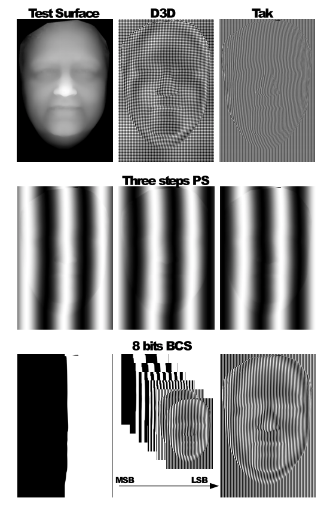
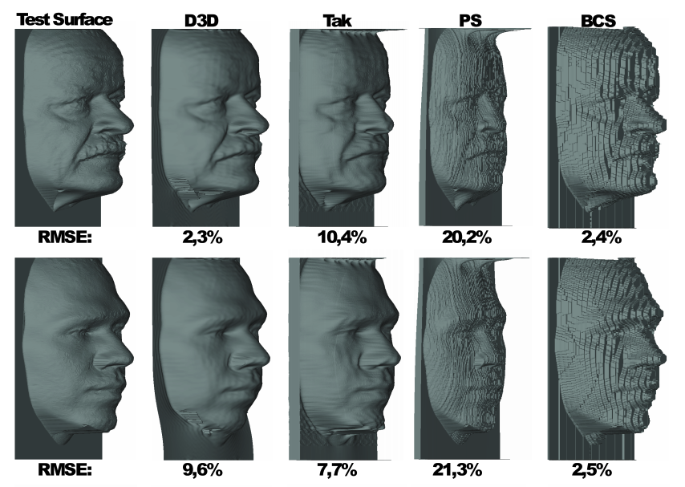

# 3D Reconstruction using structured light
_Disclaimer_ This repository collects code developed during the development of [1]. It is not maintained, and was designed with the only purpose of research. The objective at that time was to focus on the theory and new ideas, and therefore this code is not as clean as you would expect from tools designed to be transferred and shared.

Despite the previous, the core of the 3D algorithms implemented might be useful to get ideas and guidance on your research. That is the primary motivation for sharing this repo. A set of tools are implemented for (a) reconstructing 3D shapes from collected images under structured illumination, (b) obtaining the gradient of the 3D from the local deformation of projected patterns (which is the core of [1]), and (c) how to integrate a gradient field (which is a hard mathematical problem, adding absolute measures can help which is the core of [2]). In the following, some of these tools are illustrated. 

[1] J. Matías Di Martino, Alicia Fernández, Gastón Ayubi and José Ferrari. One-shot 3D gradient field scanning. Optics and Lasers in Engineering, Vol. 72, 2015

[2] J. Matias Di Martino, Jorge Flores, Jose A. Ferrari. One-shot 3D scanning by combining sparse landmarks with dense gradient information. Optics and Lasers in Engineering, Vol. 105, 2018.

## Files and organization
- Demo.m: Illustrates somem of the main tools and techniques.
- Data/ provides some toy data including: the simulation of different projected patterns, ground truth depth, and simulated images when different patterns are projected over arbitrary 3D shapes. 
- ProjectedPatterns/ provides some patterns and code to generate them, you might use this if you ever want to implement any of this techniques in the real world. 
- tmp and figures contain temporally files and can be ignored. 
- tools: here is where most interesting things are implemented. There is code for: "3dreconstruction" which includes the implementation of the ideas in [1,2] plus some traditional algorithms such as "Takeda" and "Phase-Shifting." "2dintregration" contains code to integrate a 2D gradient field using multiple techniques, e.g., least squared, weighted least squares, L1, and so on (check Appendix A of [1]). 

## Examples 
Images under the projection of different structured patterns are illustrated in /Data. Examples are illustrated below
. To try different inputs, try in lines 22 and 23 of demo.m using
```matlab
id            = '_1';  
ExpFolder     = 'Data/Faces/';
```
To grab the first face (replace '_1' with '_2' to grab the second face). Or try 
```matlab
id            = '';  
ExpFolder     = 'Data/Ramp/';
```
To try with a challenging scene that includes large discontinuities. For techniques that use local deformation to estimate 3D gradient information (like D3D), discontinuities are a crucial challenge inherited from the problem of 2D gradient field integration. A few ideas can be pushed forward to mitigate this challenge. An obvious path is to use robust integration methods (there is an extensive literature in this subject, see, e.g., [4] and references therein). We proposed [2] the use of mixed (absolute and local) patterns to help mitigating the ill-posed problem of integrating surfaces with isolated (discontinuous) parts. Alternatively, we recently showed that we might not need the actual 3D information in the first place, for example, if we are trying to use 3D information for object or subject recognition [4]. In other words, we might sometimes just be able to work with relative local depth information bypassing absolute 3D reconstruction. 

Outputs for some of the algorithms are illustrated below, and you should be able to reproduce this results using the code in /tools/* and adapting some of the examples illustrated in demo.m. Remember, Takeda and PS rely on the backend on the unwrapping algorithms which are in C [5] and you might have to re-compile. 
 

An example of running Differential 3D is illustrated below.
```matlab
% -------------------------------------------- %
fprintf('D3D>                  ')
strW = 4;
verbose = 2;
% Read the image with D3D projected pattern
I = double(imread([ExpFolder 'D3D/Stripes_Color_strW_' num2str(strW) id '.bmp']));

% Perform reconstruction
clear parameters;
parameters.verbose           = 2;
parameters.CodeType          = 'color'; %{sum, prod, color}
parameters.FiltWidth         = .1;
parameters.IntegrationMethod = 'AD'; %{'LS', 'WLS', 'AD', 'FC', 'L1', 'M'}
parameters.TextureIm         = Texture_p;
parameters.Theta             = pi/4;%1.42
[D_D3D,~,Dx,Dy,Qx,Qy]        = mt_D3D(I,parameters);
```
The main input parameters are: _CodeType_ selecting whether the horizontal and vertical patterns were combined via multiplication, sum or codded in color channels. _FiltWidth_ sets the size of the median filter applied to the gradient field before integration (which helps to regularize sparse missing or incorrect values associated to log pattern gradient, see [1]). _IntegrationMethod_ sets the technique used to integrate the 2D depth gradient field. _TextureIm_ if the texture image of the scene is available, it can be exploited for better fringe processing. _Theta_ is the angle of the baseline between the projector and the camera with respect to the camera x-axis. This is set during the deployment and depend on the geometry of the system you implement. In this demo, since we are using data simulated with the camera and projector translated 45 degrees with respect to the x-axis, we set its value to 45 degrees (in radians pi/4). The outputs of the algorithm are, the estimated depth map D_D3D, the x and y depth partial derivatives (Dx, Dy), and two "quality measures" Qx and Qy which are a proxy of how reliable Dx and Dy locally are. 


[3] A. Agrawal, R. Raskar, R. Chellappa. "What is the range of surface reconstructions from a gradient field?". Computer Vision–ECCV, Springer, 2006.

[4] J. Matias Di Martino, Fernando Suzacq, Mauricio Delbracio, Qiang Qiu, and Guillermo Sapiro. "Differential 3D Facial Recognition: Adding 3D to Your State-of-the-Art 2D Method." IEEE Trans Pattern Anal Mach Intell., 2020.

[5] Ghiglia, D. C., & Pritt, M. D. (1998). Two-dimensional phase unwrapping: theory, algorithms, and software. Wiely-Interscience, first ed.(April 1998).

## Installation and usage
This code was developed in Matlab2014, and should run in Matlab without significant modifications. You might have to adapt some functions if a tool is no longer available in the newer version of Matlab you are presumably using. Some algorithms, such as PSI (phase-shifting algorithm), use unwrapping techniques and code from [5] (the bibble of unwrapping!). You might have to compile those for your specific system. 


## Copyright and License
Copyright (C) 2015, Matias Di Martino <matiasdm@fing.edu.uy>

This is free software: you can redistribute it and/or modify
it under the terms of the GNU Affero General Public License as
published by the Free Software Foundation, either version 3 of the
License, or (at your option) any later version.

These files are distributed in the hope that they will be useful,
but WITHOUT ANY WARRANTY; without even the implied warranty of
MERCHANTABILITY or FITNESS FOR A PARTICULAR PURPOSE. See the
GNU Affero General Public License for more details.

You should have received a copy of the GNU Affero General Public License
along with this program. If not, see <http://www.gnu.org/licenses/>.


## Thanks
The authors would be grateful to recieve any comment, errors, bugs or strange results.

